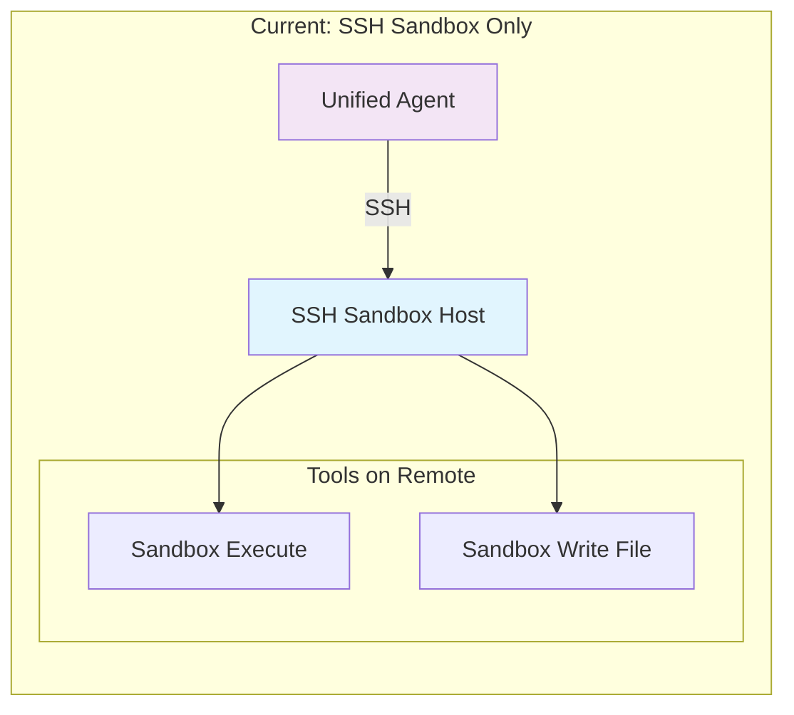

# Unified Agent — Architecture Reference

> **One Mind. Every Interface.**

This document is the technical reference for Unified Agent. It describes *why* the system is shaped the way it is, not just *what* the code does. Read this before touching `ua/core/`.

---

## 1. Vision Recap

Unified Agent is a reusable AI Core — one conversational identity, one memory, one personality — exposed through many thin interfaces (Discord, CLI, Web API, and future ones). No interface is allowed to contain reasoning, memory, or prompt logic. Interfaces call one method:

```python
response = await agent.chat(user_id=user.id, platform="discord", message=message.content)
```

Everything downstream of that call is the AI Core's problem.

---

## 2. Layered Architecture

```
┌─────────────────────────────────────────────────────────────┐
│                        INTERFACES                            │
│   discord/   cli/   web/   (telegram/ voice/ desktop later)   │
│   — thin adapters, no business logic —                        │
└───────────────────────────┬───────────────────────────────────┘
                             │  agent.chat(user_id, platform, message)
┌───────────────────────────▼───────────────────────────────────┐
│                          AI CORE                               │
│  ┌───────────────┐  ┌────────────────┐  ┌──────────────────┐  │
│  │ Conversation   │  │  Context        │  │  Personality      │ │
│  │ Manager        │  │  Builder        │  │  Loader           │ │
│  └───────┬────────┘  └───────┬────────┘  └─────────┬─────────┘ │
│          │                   │                      │           │
│  ┌───────▼───────────────────▼──────────────────────▼────────┐ │
│  │                     Memory Manager                          │ │
│  │     Short-Term  │   Long-Term   │   Knowledge               │ │
│  └───────────────────────────┬────────────────────────────────┘ │
│                               │                                  │
│  ┌────────────────────────────▼───────────────────────────────┐ │
│  │                    Model Manager (LLM Layer)                 │ │
│  │   LM Studio  │  Ollama  │  OpenAI-compatible │  (future...)  │ │
│  └────────────────────────────┬───────────────────────────────┘ │
│                               │                                  │
│  ┌────────────────────────────▼───────────────────────────────┐ │
│  │                       Tool System                            │ │
│  │   calculator │ filesystem │ web_search │ web_fetch │ sandbox_execute │ sandbox_write_file │ ... │ │
│  └───────────────────────────────────────────────────────────┘ │
└───────────────────────────────────────────────────────────────┘
```

Each box in the AI Core is an independently testable Python module with a narrow public interface. The Core never imports anything from `ua/interfaces/`.

---

## 3. Conversation Pipeline

```
User message
   │
   ▼
Interface (thin adapter)               — translates platform payload → plain args
   │
   ▼
ConversationManager.handle_message()   — session lookup/creation, turn bookkeeping
   │
   ▼
MemoryManager.retrieve(user_id, msg)   — pulls short-term + long-term + knowledge context
   │
   ▼
ContextBuilder.build(...)              — merges personality + memory + history into a prompt
   │
   ▼
ModelManager.generate(prompt, tools)   — calls the active LLM adapter
   │
   ▼
ToolExecutor.maybe_run(tool_calls)     — optional, loop back into ModelManager if needed
   │
   ▼
ConversationManager.finalize()         — builds the final response object
   │
   ▼
MemoryManager.update(user_id, turn)    — writes new short/long-term memory
   │
   ▼
Interface renders response back to user
```

This pipeline is implemented as a single async function chain in `ua/core/agent.py::UnifiedAgent.chat()`. Nothing about Discord, CLI, or Web ever appears above the "Interface" boxes.

---

## 4. Dependency Graph

```
config ──────────────┐
                      ▼
database ────────► memory ─────────┐
                      ▲             │
personality ──────────┤             ▼
                      │      conversation ─────┐
models (LLM adapters)─┤                        │
                      │                        ▼
tools ────────────────┴───────────────► core.agent (UnifiedAgent)
                                               │
                                               ▼
                                        interfaces (cli, discord, web)
```

Read as: an arrow `A ──► B` means "B depends on A". `config` has no dependencies and is imported everywhere. `interfaces` depends on everything but nothing depends on `interfaces`. This is the invariant that keeps the Core reusable — if you ever see `ua/core/` importing from `ua/interfaces/`, that's a bug.

---

## 5. Folder Structure

```
unified-agent/
├── pyproject.toml
├── README.md
├── ARCHITECTURE.md
├── CONTRIBUTING.md
├── .env.example
├── ua/
│   ├── __init__.py
│   ├── config/
│   │   ├── __init__.py
│   │   └── settings.py            # Pydantic BaseSettings, env-driven
│   ├── database/
│   │   ├── __init__.py
│   │   ├── engine.py               # async SQLAlchemy engine/session factory
│   │   └── models.py               # ORM models (messages, facts, users, sessions)
│   ├── personality/
│   │   ├── __init__.py
│   │   ├── loader.py                # reads personalities/<name>/ into a Personality object
│   │   └── schema.py                # Pydantic models for rules.json etc.
│   ├── models/                      # LLM adapter layer
│   │   ├── __init__.py
│   │   ├── base.py                  # LLMAdapter ABC
│   │   ├── lmstudio_adapter.py
│   │   ├── ollama_adapter.py
│   │   ├── openai_compat_adapter.py
│   │   └── manager.py               # ModelManager: picks adapter from config
│   ├── memory/
│   │   ├── __init__.py
│   │   ├── base.py                  # MemoryStore ABC (get/put/search)
│   │   ├── short_term.py            # in-process/session memory
│   │   ├── long_term.py             # SQLite-backed durable memory
│   │   ├── knowledge.py             # file/document store
│   │   └── manager.py               # MemoryManager: aggregates all three layers
│   ├── conversation/
│   │   ├── __init__.py
│   │   ├── manager.py                # ConversationManager: session + turn state
│   │   └── context_builder.py        # assembles final prompt
│   ├── tools/
│   │   ├── __init__.py
│   │   ├── base.py                   # Tool ABC + ToolResult
│   │   ├── registry.py               # auto-discovery + registration
│   │   ├── calculator.py             # Safe arithmetic evaluation
│   │   ├── filesystem.py             # Read-only filesystem access
│   │   ├── web_search.py             # DuckDuckGo HTML scraping
│   │   ├── web_fetch.py              # URL fetch with SSRF caveats
│   │   ├── sandbox_execute.py        # SSH remote execution
│   │   └── sandbox_write_file.py     # SSH remote file write
│   ├── core/
│   │   ├── __init__.py
│   │   ├── agent.py                  # UnifiedAgent — the single public entrypoint
│   │   └── factory.py                # build_default_agent() helper
│   └── interfaces/
│       ├── __init__.py
│       ├── cli/
│       │   └── main.py
│       ├── discord/
│       │   └── bot.py
│       └── web/
│           └── api.py                # FastAPI app
├── sandbox/
│   ├── __init__.py
│   ├── manager.py                    # SSHSandboxManager
│   └── risk_detection.py             # Blacklisted command patterns
├── web/
│   ├── __init__.py
│   ├── search_backend.py             # DuckDuckGo scraping
│   └── ssrf_guard.py                # SSRF validation (see limitations)
├── personalities/
│   ├── assistant/                    # General helper (calculator)
│   ├── tester/                       # Testing use (calculator, filesystem)
│   └── coding/                       # Coding assistant (full tool set)
├── tests/
│   ├── conftest.py
│   ├── test_config.py
│   ├── test_personality.py
│   ├── test_models/
│   ├── test_memory/
│   ├── test_conversation/
│   ├── test_tools/
│   ├── test_sandbox/
│   └── test_web/
├── docs/
│   ├── getting-started.md
│   ├── writing-a-tool.md
│   ├── writing-a-personality.md
│   └── writing-an-adapter.md
└── examples/
    ├── minimal_cli_chat.py
    ├── custom_tool_example.py
    ├── switch_personality.py
    └── sandbox_and_web_tools_demo.py
```

---

## 6. Memory Architecture

Three layers behind one `MemoryStore` interface (`ua/memory/base.py`):

```python
class MemoryStore(Protocol):
    async def get(self, user_id: str, key: str) -> Any: ...
    async def put(self, user_id: str, key: str, value: Any) -> None: ...
    async def search(self, user_id: str, query: str, limit: int = 5) -> list[MemoryItem]: ...
```

- **Short-Term** (`short_term.py`): recent turns, active task, current topic. Backed by an in-process dict/deque keyed by `(user_id, platform)`, capped in size. Ephemeral — safe to lose on restart in v1.
- **Long-Term** (`long_term.py`): user preferences, facts, relationships, goals, prior conversation summaries. Backed by SQLite via `ua/database/`. This is durable and queryable.
- **Knowledge** (`knowledge.py`): uploaded files, docs, notes. v1 stores raw text + metadata rows in SQLite; the `search()` method signature is designed so it can be swapped for a vector DB (e.g., Chroma/Qdrant) later **without changing the `MemoryStore` interface or any caller**.

`MemoryManager` (`memory/manager.py`) is the only thing `ConversationManager` talks to; it composes the three stores and decides what to fetch/write. This indirection is what makes "add a vector DB later" a one-file change instead of a redesign.

---

## 7. Personality Architecture

Personality is pure data, never Python control flow. Each personality is a directory:

```
personalities/<name>/
├── system.md        # system prompt fragment
├── style.md          # tone/voice guidance, appended to system prompt
├── rules.json        # structured constraints (do/don't, tool permissions, limits)
└── greetings.txt      # line-per-greeting, picked randomly/contextually
```

`PersonalityLoader.load(name)` returns a `Personality` Pydantic model. `ContextBuilder` concatenates `system.md` + `style.md` + relevant `rules.json` entries into the system portion of the prompt. Switching personalities = changing a config value + adding a directory; zero code changes.

---

## 8. Tool Architecture

```python
class Tool(ABC):
    name: str
    description: str
    parameters: dict  # JSON schema, used for LLM tool-calling

    @abstractmethod
    async def run(self, **kwargs) -> ToolResult: ...
```

`ToolRegistry` (`tools/registry.py`) auto-discovers tools by scanning `ua/tools/` for `Tool` subclasses at startup (simple `pkgutil`-based discovery, no magic decorators required, though a `@register_tool` decorator is provided for convenience). `ModelManager` receives the registry's tool schemas and passes them to the LLM adapter's `generate(..., tools=...)` call. `UnifiedAgent` executes any returned tool calls, feeds results back into a follow-up `generate()` call, and only then returns the final response.

Adding a new tool = drop a file in `ua/tools/`, subclass `Tool`. No other file needs to change.

---

## 9. LLM Adapter Architecture

```python
class LLMAdapter(ABC):
    @abstractmethod
    async def generate(
        self,
        messages: list[Message],
        tools: list[ToolSchema] | None = None,
        **kwargs,
    ) -> LLMResponse: ...
```

Every provider (`lmstudio_adapter.py`, `ollama_adapter.py`, `openai_compat_adapter.py`) implements this one method and normalizes its provider-specific response into a shared `LLMResponse` dataclass (`content`, `tool_calls`, `raw`). `ModelManager` reads `settings.LLM_PROVIDER` from config and instantiates the matching adapter — this is the only place that branches on provider name. Everything above `ModelManager` only ever sees `LLMResponse`.

---

## 10. Interface Architecture

Every interface module does exactly three things:

1. Receive a platform-native event (Discord message, CLI input line, HTTP request).
2. Extract `user_id`, `platform`, `message` (and optional `attachments`).
3. Call `await agent.chat(...)` and render the platform-native response.

No interface module may import from `ua/memory/`, `ua/models/`, `ua/tools/`, or `ua/personality/` directly. If an interface needs something the Core doesn't expose, that's a sign the Core's public API needs to grow — not that the interface should reach around it.

---

## 11. Configuration

`ua/config/settings.py` defines one `Settings(BaseSettings)` class (Pydantic v2). All values are overridable via environment variables (`.env` supported via `python-dotenv`/pydantic-settings). No module reads `os.environ` directly outside this file. Example fields: `LLM_PROVIDER`, `LLM_BASE_URL`, `LLM_MODEL`, `DATABASE_URL`, `ACTIVE_PERSONALITY`, `DISCORD_TOKEN`, `LOG_LEVEL`.

---

## 12. Extensibility Notes (Future Features)

The layering above is deliberately built so these require **additive**, not structural, changes:

- **Vector memory** → new `MemoryStore` implementation behind the existing interface.
- **Model routing / specialist models** → `ModelManager` gains a routing strategy; `LLMAdapter` interface unchanged.
- **Streaming responses** → `LLMAdapter.generate` gains a `stream: bool` flag returning an async generator; callers opt in.
- **Multi-agent collaboration** → multiple `UnifiedAgent` instances with distinct personalities, orchestrated by a new (later) `ua/core/orchestrator.py` that itself just calls `.chat()` on each agent.
- **Voice / vision** → new Interfaces + a new `Message` content type (audio/image), not a new Core.
- **Background workers / scheduling** → a new `ua/core/scheduler.py` that calls `agent.chat()` on a timer, same as any interface.
- **Future modalities (TTS, STT/speech-to-text, vision, avatar/animation control, game-playing agents)** → explicitly deferred. When eventually built, each gets its own parallel manager/adapter pair (e.g. `TTSManager`/`TTSAdapter`, `VisionManager`/`VisionAdapter`) with method signatures shaped for that modality's I/O (text-in/audio-out, image input, etc.), NOT extensions to `ModelManager`/`LLMAdapter`. Forcing these into `LLMAdapter.generate()`'s text-in/text-out contract would be the wrong abstraction.

---

## 13. Non-Goals (v1)

- No vector database (interface is ready, implementation is not).
- No multi-agent orchestration.
- No streaming (single-shot request/response only).
- No auth/session management beyond `user_id` string keys.
- No Docker/Kubernetes packaging.

These are explicitly deferred so early batches stay small and verifiable.

---

## 14. Execution Model

The Tool System currently supports one execution mode:



### Available Execution Capabilities

| Mode | Status | Location | Notes |
|------|--------|----------|-------|
| Local code execution | Not Implemented | N/A | There is no tool that executes code on the same machine as the agent process. All execution-capable tools use SSH. |
| SSH Sandbox Execution | Implemented | `ua/tools/sandbox_execute.py` | Requires configured `UA_SANDBOX_HOST`. Has CLI confirmation gating for blacklisted patterns (sudo, rm -rf, etc.). Web API/Discord interfaces auto-reject risky commands. |
| SSH Sandbox File Write | Implemented | `ua/tools/sandbox_write_file.py` | Requires configured `UA_SANDBOX_HOST`. **No confirmation gating** - see security warnings in the tool's docstring. |
| SSH Connection Security | Partial | `ua/sandbox/manager.py` | Uses `known_hosts=None` (MITM vulnerable) - intentional for disposable sandbox hosts. |

### Security Boundaries

- **The SSH sandbox host must be disposable and isolated** - treat it as an ephemeral VM/container
- **sandbox_execute** uses a blacklist-based risk detector (`ua/sandbox/risk_detection.py`) with CLI confirmation; this is defense-in-depth, not a security guarantee
- **sandbox_write_file** has NO confirmation gating - it will write any file the agent requests
- **No local execution exists** - if you need to run code on the agent's own machine, that capability is not yet implemented

### Planned Execution Providers (Future Work)

| Provider | Status | Notes |
|----------|--------|-------|
| Docker execution | Not Implemented | Would allow containerized tool execution; design would follow a similar pattern to SSH (tool calls through a manager) |
| Local execution | Not Implemented | Would require significant security hardening before being exposed to LLM control |

