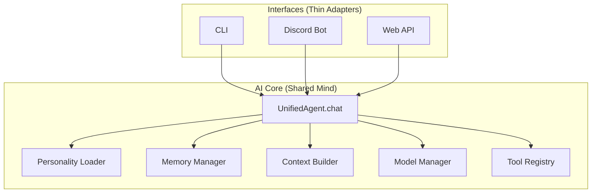

# Unified Agent

**One Mind. Every Interface.**

A reusable AI Core that provides a single conversational identity with memory and personality, exposed through multiple thin interfaces (CLI, Discord, Web API).

## What is this?

Unified Agent is a Python library that implements a complete AI conversation pipeline:

- **Unified identity**: One personality, one memory system, accessible from all interfaces
- **Multiple interfaces**: CLI, Discord bot, and Web API are included out of the box
- **Pluggable LLM providers**: Works with LM Studio, Ollama, OpenAI-compatible APIs, or a fake provider for testing
- **Built-in tools**: Calculator, Filesystem (read-only), Web Search, Web Fetch, and SSH Sandbox tools (remote execution)

### Available Tools

| Tool | Description | Requirements |
|------|-------------|--------------|
| `calculator` | Safe arithmetic expression evaluation | None - auto-discovered |
| `filesystem` | Read files or list directories within a sandbox | Requires `sandbox_root` - manual registration |
| `web_search` | DuckDuckGo HTML web search (no API key) | None - auto-discovered |
| `web_fetch` | Fetch URL and extract text content | None - auto-discovered; see security notes below |
| `sandbox_execute` | Execute shell commands on remote SSH host | Requires configured `UA_SANDBOX_HOST` |
| `sandbox_write_file` | Write files to remote SSH host | Requires configured `UA_SANDBOX_HOST` |

### Available Personalities

| Personality | Tools Allowed | Purpose |
|-------------|---------------|---------|
| `assistant` | calculator | General-purpose helpful assistant |
| `tester` | calculator, filesystem | Testing and development use |
| `coding` | calculator, sandbox_write_file, sandbox_execute, web_search, web_fetch | Coding assistant with full capabilities |

See [docs/writing-a-personality.md](docs/writing-a-personality.md) for creating custom personalities.

## Architecture Overview



The core philosophy: **One Mind. Every Interface.** Each interface is a thin adapter that calls `agent.chat()` and renders the response. All reasoning, memory, and tool logic lives in the AI Core. See [Architecture.md](Architecture.md) for details.

## Installation (from source)

```bash
# Clone and install in editable mode
git clone <repo-url>
cd unified-agent
uv sync --extra dev  # Includes test dependencies
```

See [docs/getting-started.md](docs/getting-started.md) for prerequisites and verification steps.

## Quick Start: CLI Chat

The fastest way to try Unified Agent is the built-in CLI with the fake provider (no API key required):

```bash
# Set up environment for testing
export UA_LLM_PROVIDER=fake
export UA_DATABASE_URL="sqlite+aiosqlite:///:memory:"

# Run the CLI
uv run unified-agent-cli
```

Once the CLI starts, type messages and press Enter:

```
You: Hello!
Agent: echo: Hello!
```

Press Ctrl+D or enter an empty line to exit.

## Configuration

Unified Agent is configured via environment variables:

| Variable | Required | Default | Description |
|----------|----------|---------|-------------|
| `UA_LLM_PROVIDER` | No | `fake` | LLM provider: `lmstudio`, `ollama`, `openai_compat`, or `fake` |
| `UA_LLM_BASE_URL` | Depends | Provider-specific | Base URL for LM Studio or Ollama |
| `UA_LLM_MODEL` | Depends | Provider-specific | Model name to use |
| `UA_DATABASE_URL` | No | `sqlite+aiosqlite:///./unified_agent.db` | SQLAlchemy database URL |
| `UA_DISCORD_TOKEN` | For Discord | - | Discord bot token |
| `UA_SANDBOX_HOST` | For sandbox tools | - | SSH sandbox hostname (see Security notes) |
| `UA_SANDBOX_PORT` | For sandbox tools | `22` | SSH port |
| `UA_SANDBOX_USERNAME` | For sandbox tools | - | SSH username |
| `UA_SANDBOX_KEY_PATH` | For sandbox tools | - | Path to SSH private key |

> **Note**: The `fake` provider is the default, so no configuration is required for testing. The default database path creates `unified_agent.db` in the current directory, so in-memory is recommended for testing.

## Security Philosophy

Unified Agent uses defense-in-depth security with clear caveats:

### SSH Sandbox Tools
- Require a **disposable remote host** configured via `UA_SANDBOX_HOST`
- The sandbox host should be isolated and rebuildable - treat it as ephemeral
- `sandbox_execute` has **blacklisted pattern detection** (sudo, rm -rf, etc.) with CLI confirmation gating
- `sandbox_write_file` currently has **NO confirmation gating** - see warning in `.env.example`
- Host key verification is disabled (`known_hosts=None`) - only use trusted networks

### Web Fetch Tool
- Includes SSRF protection against private IP ranges
- **DNS rebinding is NOT mitigated** - there's a TOCTOU window between validation and request
- Redirect following is implemented with per-redirect re-validation
- Response size limited to 1MB, extracted text truncated to ~5,000 chars

See the docstrings in `ua/tools/sandbox_execute.py`, `ua/tools/sandbox_write_file.py`, and `ua/web/ssrf_guard.py` for full security disclosures.

## Interfaces

### CLI

```bash
uv run unified-agent-cli
```

### Web API

```bash
export UA_LLM_PROVIDER=fake
export UA_DATABASE_URL="sqlite+aiosqlite:///:memory:"
uv run uvicorn ua.interfaces.web.api:app --port 8000
# Then POST to http://localhost:8000/chat
```

### Discord Bot

```bash
export UA_LLM_PROVIDER=fake
export UA_DISCORD_TOKEN=your_token_here
uv run python -c "from ua.interfaces.discord.bot import run; run()"
```

## Project Structure

```
unified-agent/
├── ua/                    # Main package
│   ├── core/              # AI Core (agent, factory)
│   ├── interfaces/        # Thin adapters (cli, discord, web)
│   ├── memory/            # Memory system (short-term, long-term, knowledge)
│   ├── models/            # LLM adapters
│   ├── tools/             # Tool implementations
│   └── personality/       # Personality loader
├── docs/                  # Documentation
├── examples/              # Example scripts
├── tests/                 # Test suite
├── Architecture.md        # Architecture reference
├── Contributing.md        # Contribution guide
└── README.md              # This file
```

## Documentation

- **[Architecture.md](Architecture.md)** - Technical architecture and design rationale
- **[Contributing.md](Contributing.md)** - How to contribute to the project
- **[docs/getting-started.md](docs/getting-started.md)** - Detailed setup guide
- **[docs/writing-a-tool.md](docs/writing-a-tool.md)** - How to create custom tools
- **[docs/writing-a-personality.md](docs/writing-a-personality.md)** - How to create personalities
- **[docs/writing-an-adapter.md](docs/writing-an-adapter.md)** - How to add LLM providers

## Development

```bash
# Run tests
uv run pytest

# Lint
uv run ruff check .

# Format
uv run ruff format .
```

## License

MIT License - see [LICENSE](LICENSE) file for details.

## Status

This is v1 of the project. See [Roadmap.md](Roadmap.md) for development history and completed features.